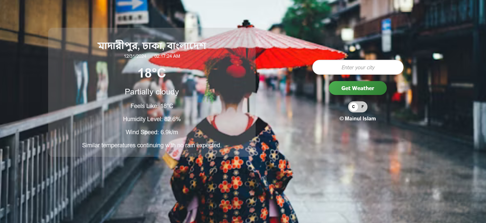
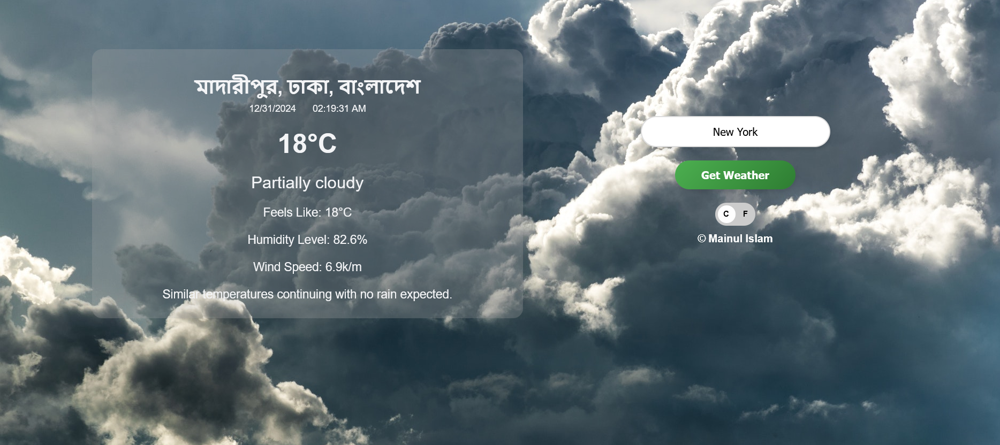
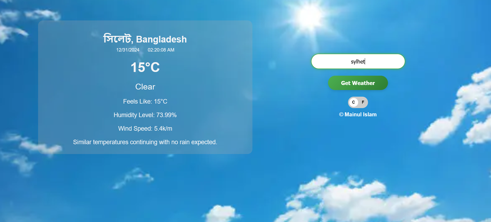

# Weather App

This is a simple weather app that fetches weather data based on the location you provide.

[Live Site](https://mainul-islam-nirob.github.io/weather-app/ "visit") 

## Features

- Fetch weather data from the Visual Crossing API.
- Toggle between Fahrenheit and Celsius.
- Displays temperature, humidity, wind speed, and weather condition.
- Change Background image of the app based on the condition of weather.

## How to Use

1. Enter a location in the input box.
2. Click on the "Get Weather" button.
3. Toggle the switch to change between Fahrenheit and Celsius.

## Technology Used

- HTML
- CSS
- JavaScript

## Author

- Mainul Islam
